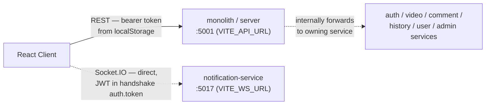
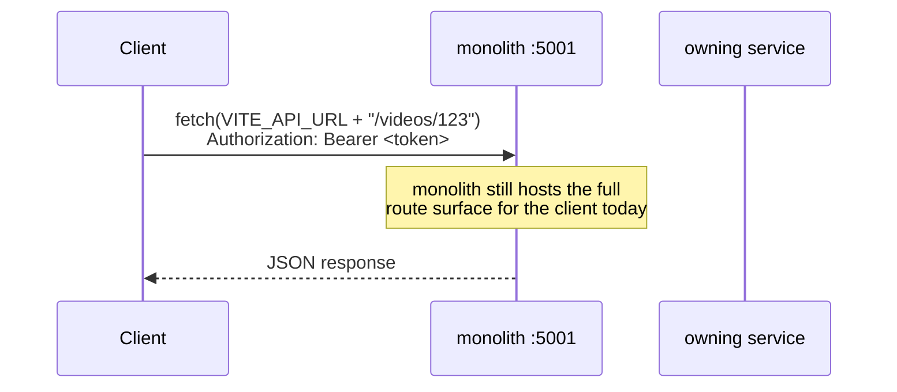
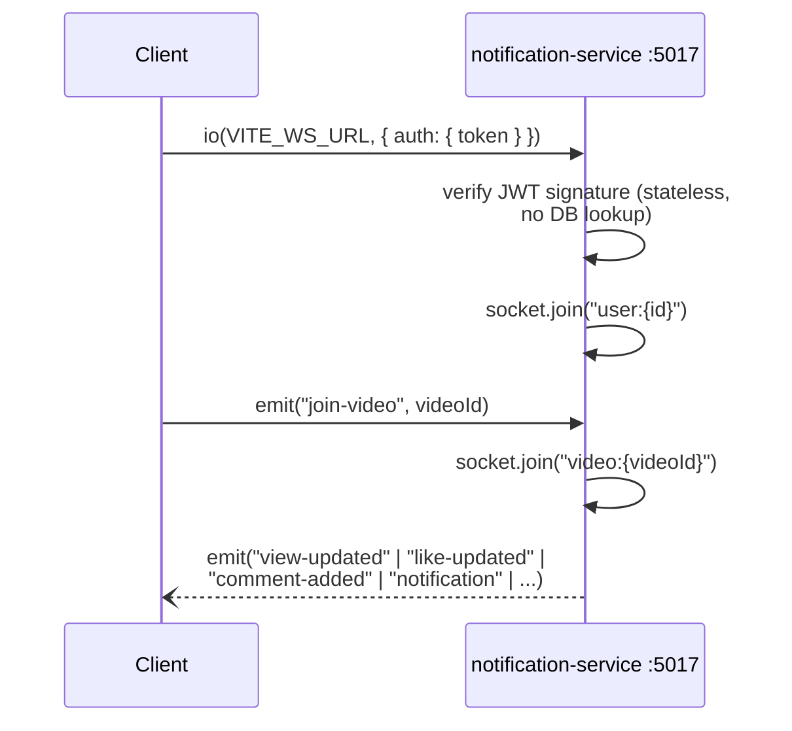
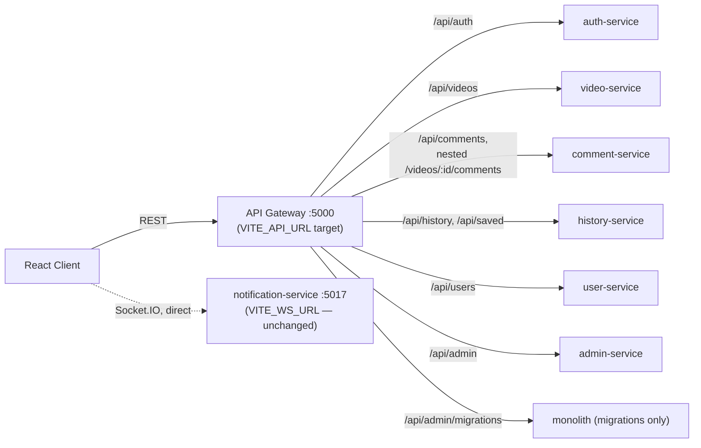

# Client–Server Communication

> For the step-by-step path a single request takes (routing, auth, DB, notifications), see [`master-flow.md`](./master-flow.md).

## Current state (what's actually wired up today)

The gateway exists and is fully verified (see [`services-overview.md`](./services-overview.md)), but the React client has **not** been cut over to it yet. `client/src/store/api/baseApi.ts` still calls `VITE_API_URL` directly against the monolith on port 5001, which forwards each request to the right service internally the same way the gateway would — the client just isn't going through the gateway itself.

Source: [`client/src/store/api/baseApi.ts`](../../client/src/store/api/baseApi.ts), [`client/src/store/socket.ts`](../../client/src/store/socket.ts)

### REST request flow (current)

### Socket.IO flow (current — independent of REST path)

## Intended end state (designed, not yet live)

Once the client's `VITE_API_URL` is pointed at the gateway (`http://localhost:5000/api`) instead of the monolith directly, every REST request routes through the gateway's per-prefix table — the exact same routing already verified in [`gateway/src/routes.ts`](../../gateway/src/routes.ts). The Socket.IO connection is unaffected either way, since the client already connects to notification-service directly and bypasses the gateway.

**Cutover is a one-line change** — set `VITE_API_URL=http://localhost:5000/api` (or the deployed gateway URL) in the client's environment. No client code changes are needed since the API surface and paths are identical.
