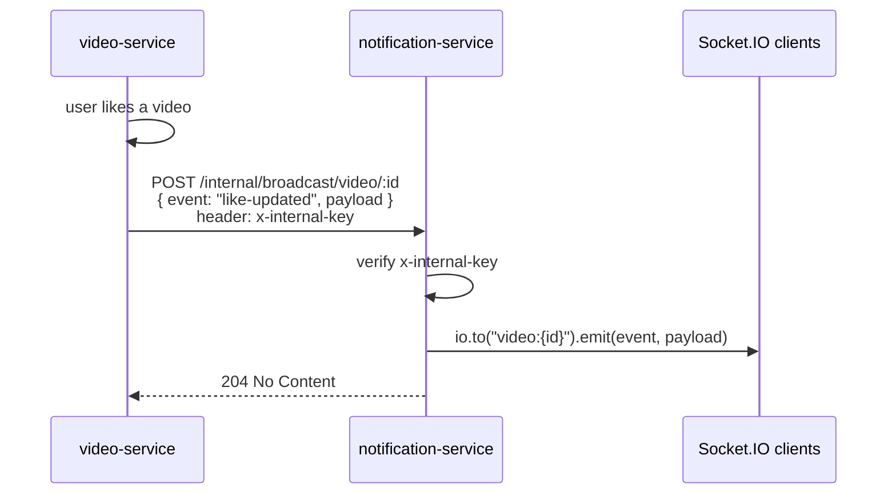
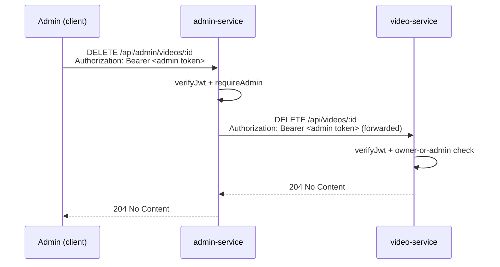
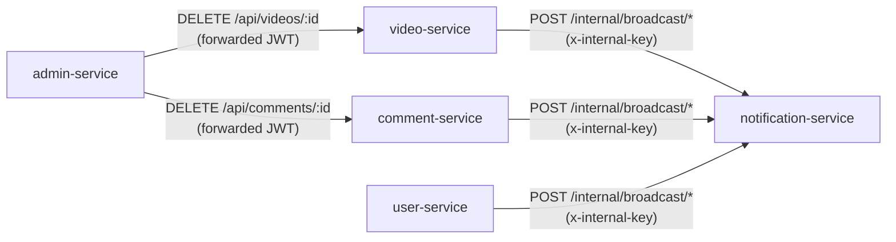

# Interservice Communication

The actual HTTP calls services make to each other. There is no message broker — every call is a direct HTTP request, secured either by JWT (for admin's forwarded requests) or a shared internal key (for the notification relay).

> For where these calls fit into a full request's lifecycle, see [`master-flow.md`](./master-flow.md).

## 1. Notification relay pattern

`video-service`, `comment-service`, and `user-service` never talk to Socket.IO directly — they POST to `notification-service`'s internal API, which then emits the real-time event to connected clients.

Source: [`services/video-service/src/sockets/socket.service.ts`](../../services/video-service/src/sockets/socket.service.ts), [`services/notification-service/src/internal.routes.ts`](../../services/notification-service/src/internal.routes.ts)

The same pattern is used for:

| Caller | Trigger | Broadcast target |
|---|---|---|
| video-service | view recorded, like toggled, upload finished/failed | `video:{id}` room, `user:{id}` room |
| comment-service | comment added, comment like toggled | `video:{id}` room |
| user-service | new subscriber, dashboard-affecting event | `user:{id}` room (`dashboard-invalidate`) |

## 2. Admin forwarding pattern

Admin-service doesn't duplicate the owner-or-admin authorization rule for deleting a video or comment — it forwards the admin's own bearer token to the service that actually owns that rule, and that service re-validates the JWT itself.

Source: [`services/admin-service/src/controllers/admin.controller.ts`](../../services/admin-service/src/controllers/admin.controller.ts)

The same pattern applies to `DELETE /api/admin/comments/:id` → `comment-service`.

## 3. All interservice edges at a glance

