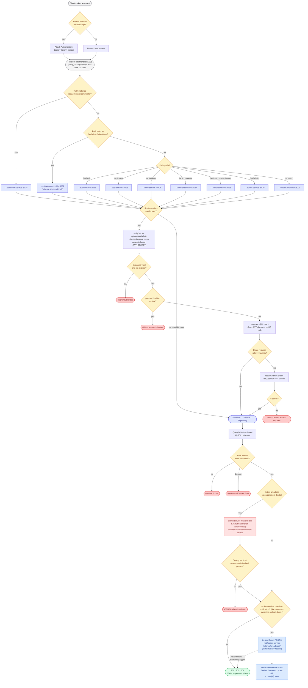

# Master Flow — One Request, Every Layer

A single low-level flowchart tracing **any** API request from the browser all the way to the response, through every real decision point in the code: gateway routing, JWT auth, admin checks, business logic, DB access, the notification side-effect, and the admin-forwarding special case.

This complements the other diagrams rather than repeating them:

| Diagram | What it shows |
|---|---|
| [`services-overview.md`](./services-overview.md) | What each service *is* and owns |
| [`interservice-communication.md`](./interservice-communication.md) | Specific service-to-service call patterns |
| [`client-server-communication.md`](./client-server-communication.md) | Client's current vs. intended entry point |
| **`master-flow.md`** (this file) | The step-by-step path **one request** takes, with every branch |

> Sources: [`gateway/src/routes.ts`](../../gateway/src/routes.ts) · [`shared/auth-middleware/src/index.ts`](../../shared/auth-middleware/src/index.ts) · [`services/admin-service/src/middleware/requireAdmin.ts`](../../services/admin-service/src/middleware/requireAdmin.ts) · [`services/video-service/src/sockets/socket.service.ts`](../../services/video-service/src/sockets/socket.service.ts) · [`services/admin-service/src/controllers/admin.controller.ts`](../../services/admin-service/src/controllers/admin.controller.ts)

## Legend

| Color | Meaning |
|---|---|
| 🟡 Amber diamond | A decision point / branch in the request path |
| 🟦 Indigo box | A service handling the request |
| 🔵 Blue box | Fire-and-forget async call (never blocks the response) |
| 🔴 Red box | Synchronous forwarded call (caller waits for the real result) |
| 🟢 Green | Successful terminal response |
| 🔴 Red terminal | Error terminal response |

## Key things this diagram makes explicit

- **Auth is stateless almost everywhere.** `verifyJwt`/`optionalVerifyJwt` never hit the database — `disabled` and `role` are trusted straight from the JWT claims (set at login/register time by auth-service). The one exception is the monolith's own `/api/admin/migrations` route, which still uses the older DB-backed `authMiddleware`.
- **The notification side-effect never affects the response.** It's dispatched after the main DB write succeeds and is genuinely fire-and-forget — a slow or dead notification-service delays or breaks nothing for the user.
- **Admin video/comment deletes are the only place one service calls another synchronously mid-request** — everywhere else, a request is handled by exactly one service.
- **Routing is ordered, not a flat lookup** — the two path-based exceptions (nested comments, migrations) are checked *before* the general prefix rules, because Express/http-proxy-middleware take the first match.
