# Master Flow — One Request, Every Layer

A single low-level flowchart tracing **any** API request from the browser all the way to the response, through every real decision point in the code: gateway routing, JWT auth, admin checks, business logic, DB access, the notification side-effect, and the admin-forwarding special case.

This complements the other diagrams rather than repeating them:

| Diagram | What it shows |
|---|---|
| [`services-overview.md`](./services-overview.md) | What each service *is* and owns |
| [`interservice-communication.md`](./interservice-communication.md) | Specific service-to-service call patterns |
| [`client-server-communication.md`](./client-server-communication.md) | Client's current vs. intended entry point |
| **`master-flow.md`** (this file) | The step-by-step path **one request** takes, with every branch |

> Sources: [`gateway/src/routes.ts`](../../gateway/src/routes.ts) · [`shared/auth-middleware/src/index.ts`](../../shared/auth-middleware/src/index.ts) · [`services/admin-service/src/middleware/requireAdmin.ts`](../../services/admin-service/src/middleware/requireAdmin.ts) · [`services/video-service/src/sockets/socket.service.ts`](../../services/video-service/src/sockets/socket.service.ts) · [`services/admin-service/src/controllers/admin.controller.ts`](../../services/admin-service/src/controllers/admin.controller.ts)

```mermaid
graph TD
    classDef entry fill:#f4f4f5,stroke:#71717a,color:#18181b
    classDef decision fill:#fef3c7,stroke:#d97706,color:#78350f
    classDef relay fill:#dbeafe,stroke:#3b82f6,color:#1e3a8a
    classDef forward fill:#fee2e2,stroke:#ef4444,color:#7f1d1d
    classDef success fill:#dcfce7,stroke:#16a34a,color:#14532d
    classDef error fill:#fecaca,stroke:#dc2626,color:#7f1d1d
    classDef svc fill:#e0e7ff,stroke:#4f46e5,color:#312e81

    Start(["Client makes a request<br/>(fetch/axios with<br/>credentials: include)"]):::entry
    Start --> HasCookie{"access_token httpOnly<br/>cookie present & valid?"}:::decision
    HasCookie -->|yes, not expired| Attach["Cookie sent automatically<br/>by the browser — no JS<br/>ever reads the token"]
    HasCookie -->|no / expired| Refresh["POST /api/auth/refresh<br/>Cookie: refresh_token=..."]
    Refresh --> RefreshOk{"Refresh token valid<br/>&amp; not disabled?"}:::decision
    RefreshOk -->|yes| Rotate["Rotate: delete old<br/>refresh_token row, issue new<br/>access_token + refresh_token cookies"]
    RefreshOk -->|no| ClearAndLogin["Clear both cookies,<br/>client redirects to login"]:::error
    Rotate --> Attach
    Attach --> Dispatch

    Dispatch(["Request hits monolith :5001<br/>(today) — or gateway :5000<br/>once cut over"]):::entry
    Dispatch --> Helmet["helmet() + CORS(credentials: true)<br/>+ rate limiter<br/>(100 req/15min per IP, defense in depth<br/>at every service and at the gateway)"]:::entry
    Helmet --> RateOk{"Under the<br/>rate limit?"}:::decision
    RateOk -->|no| E429(["429 Too Many Requests"]):::error
    RateOk -->|yes| R1{"Path matches<br/>/api/videos/:id/comments ?"}:::decision
    R1 -->|yes| Comment["→ comment-service :5014"]:::svc
    R1 -->|no| R2{"Path matches<br/>/api/admin/migrations ?"}:::decision
    R2 -->|yes| Monolith["→ stays on monolith :5001<br/>(schema source of truth)"]:::svc
    R2 -->|no| R3{"Path prefix?"}:::decision

    R3 -->|"/api/auth"| Auth["→ auth-service :5011"]:::svc
    R3 -->|"/api/users"| User["→ user-service :5012"]:::svc
    R3 -->|"/api/videos"| Video["→ video-service :5013"]:::svc
    R3 -->|"/api/comments"| Comment2["→ comment-service :5014"]:::svc
    R3 -->|"/api/history or /api/saved"| History["→ history-service :5015"]:::svc
    R3 -->|"/api/admin"| Admin["→ admin-service :5016"]:::svc
    R3 -->|"no match"| Fallback["→ default: monolith :5001"]:::svc

    Comment --> NeedsAuth
    Monolith --> NeedsAuth
    Auth --> NeedsAuth
    User --> NeedsAuth
    Video --> NeedsAuth
    Comment2 --> NeedsAuth
    History --> NeedsAuth
    Admin --> NeedsAuth
    Fallback --> NeedsAuth

    NeedsAuth{"Route requires<br/>a valid user?"}:::decision
    NeedsAuth -->|no — public route| Handler
    NeedsAuth -->|yes| VerifyJwt["verifyJwt (or optionalVerifyJwt):<br/>read req.cookies.access_token<br/>(cookie-parser already ran),<br/>check signature + exp<br/>against shared JWT_SECRET"]

    VerifyJwt --> JwtOk{"Cookie present, signature<br/>valid, and not expired?"}:::decision
    JwtOk -->|no| E401(["401 Unauthorized<br/>(client's baseQueryWithReauth<br/>triggers a refresh + retry)"]):::error
    JwtOk -->|yes| DisabledCheck{"payload.disabled<br/>== true?"}:::decision
    DisabledCheck -->|yes| E403a(["403 — account disabled"]):::error
    DisabledCheck -->|no| SetUser["req.user = { id, role }<br/>(from JWT claims — no DB call)"]

    SetUser --> NeedsAdmin{"Route requires<br/>role === admin?"}:::decision
    NeedsAdmin -->|no| Handler
    NeedsAdmin -->|yes| RequireAdmin["requireAdmin: check<br/>req.user.role === 'admin'"]
    RequireAdmin --> AdminOk{"Is admin?"}:::decision
    AdminOk -->|no| E403b(["403 — admin access required"]):::error
    AdminOk -->|yes| Handler

    Handler(["Controller → Service → Repository"]):::svc
    Handler --> DbCall["Query/write the shared<br/>MySQL database"]
    DbCall --> DbOk{"Row found /<br/>write succeeded?"}:::decision
    DbOk -->|no| E404(["404 Not Found"]):::error
    DbOk -->|db error| E500(["500 Internal Server Error"]):::error
    DbOk -->|yes| IsAdminDelete{"Is this an admin<br/>video/comment delete?"}:::decision

    IsAdminDelete -->|yes| Forward["admin-service forwards the<br/>SAME access_token cookie synchronously<br/>to video-service / comment-service"]:::forward
    Forward --> ForwardResult{"Owning service's<br/>owner-or-admin check passes?"}:::decision
    ForwardResult -->|no| E403c(["403/404 relayed verbatim"]):::error
    ForwardResult -->|yes| NeedsNotify

    IsAdminDelete -->|no| NeedsNotify

    NeedsNotify{"Action needs a real-time<br/>notification? (like, comment,<br/>subscribe, upload done...)"}:::decision
    NeedsNotify -->|no| Respond
    NeedsNotify -->|yes| Relay["fire-and-forget POST to<br/>notification-service<br/>/internal/broadcast/*<br/>(x-internal-key header)"]:::relay
    Relay -.->|"never blocks —<br/>errors only logged"| Respond
    Relay --> SocketEmit["notification-service emits<br/>Socket.IO event to video:{id}<br/>or user:{id} room"]:::relay

    Respond(["200 / 201 / 204<br/>JSON response to client"]):::success

    class E401,E403a,E403b,E403c,E404,E429,E500,ClearAndLogin error
```

## Legend

| Color | Meaning |
|---|---|
| 🟡 Amber diamond | A decision point / branch in the request path |
| 🟦 Indigo box | A service handling the request |
| 🔵 Blue box | Fire-and-forget async call (never blocks the response) |
| 🔴 Red box | Synchronous forwarded call (caller waits for the real result) |
| 🟢 Green | Successful terminal response |
| 🔴 Red terminal | Error terminal response |

## Key things this diagram makes explicit

- **The JWT lives in an httpOnly cookie, not `localStorage`.** `access_token` (15 min) and `refresh_token` (30 days, opaque random string, `/api/auth` path only) are both `httpOnly`, `SameSite=Lax`, and `Secure` in production. No client-side JS ever reads the token — it can't be exfiltrated via XSS, and the browser attaches it automatically because every request is sent with `credentials: "include"`.
- **Refresh is automatic and rotating.** On a 401, the client's RTK Query `baseQueryWithReauth` wrapper transparently calls `POST /api/auth/refresh`, which validates the presented refresh token against a hashed row in `minitube_refresh_tokens`, deletes it (rotation), and issues a brand-new access+refresh pair — the original request is retried once with no visible interruption. A refresh token that's expired, missing, or already rotated-out (replay) forces a real logout.
- **Auth is stateless for the access token, stateful for the refresh token.** `verifyJwt`/`optionalVerifyJwt` never hit the database for the access token — `disabled` and `role` are trusted straight from the JWT claims (set at login/register time by auth-service). The refresh token *is* checked against the DB on every use, which is what makes sessions revocable. The monolith's own `/api/admin/migrations` route is the one exception that still does a DB lookup per request (its own older `authMiddleware`, `server/src/middleware/auth.ts`) — but it now reads the `access_token` cookie too, same as every other service, so it isn't broken by the cookie migration.
- **Helmet, CORS, and rate limiting run at every layer.** `helmet()` and a default rate limiter (100 req/15min per IP, from the shared `@mini-tube/security-middleware` package) run at the gateway *and* at every individual service (defense in depth, in case a service is ever reached directly). `auth-service`'s `/register`, `/login`, `/forgot-password`, and `/reset-password` additionally share a much stricter limiter (8 req/15min) against brute-force/enumeration.
- **The notification side-effect never affects the response.** It's dispatched after the main DB write succeeds and is genuinely fire-and-forget — a slow or dead notification-service delays or breaks nothing for the user.
- **Admin video/comment deletes are the only place one service calls another synchronously mid-request** — everywhere else, a request is handled by exactly one service. The forwarded call carries the admin's own `access_token` cookie (as a `Cookie` header), not a Bearer token.
- **Routing is ordered, not a flat lookup** — the two path-based exceptions (nested comments, migrations) are checked *before* the general prefix rules, because Express/http-proxy-middleware take the first match.
