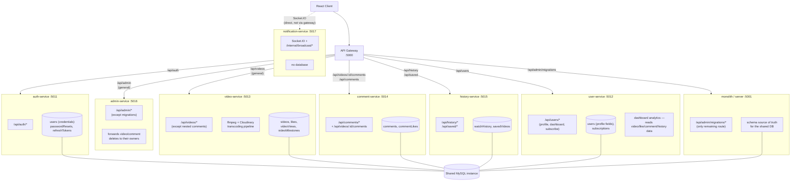

# Services Overview

All 7 services + the gateway, and what each one owns. This reflects the live routing table in [`gateway/src/routes.ts`](../../gateway/src/routes.ts).

> For the step-by-step path a single request takes through auth, routing, and DB access, see [`master-flow.md`](./master-flow.md).

> **Interim state:** every service below still connects to the **same shared MySQL instance** — a true database-per-service split hasn't happened yet (see the migration plan). Ownership here means "which service's code writes to this table," not "which service has its own database."

