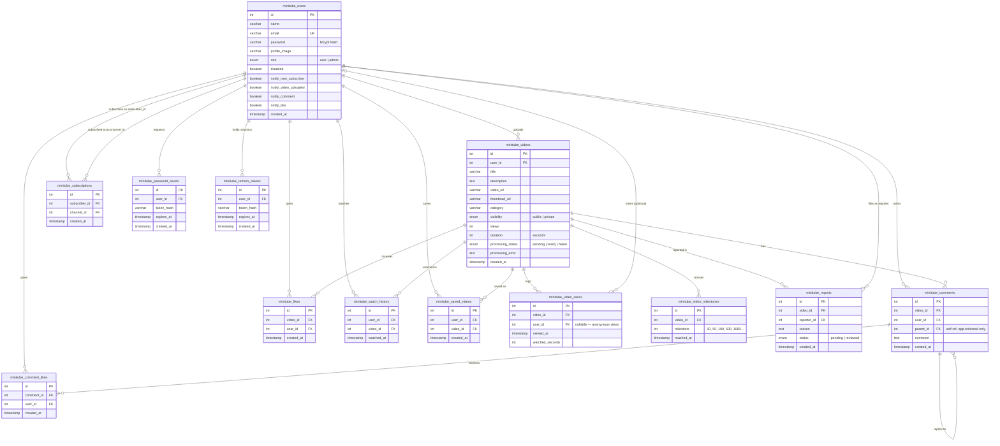

# Database ER Diagram

The full shared MySQL schema, rendered as a Mermaid ER diagram — viewable directly in VS Code or GitHub, no external tool needed. For an editable version (drag nodes, export SVG/PNG, tweak live), see [`database.dbml`](./database.dbml) on [dbdiagram.io](https://dbdiagram.io).

> All 13 tables currently live in **one shared MySQL instance**. The 🏷️ tag on each table shows which microservice owns writes to it today — see [`../flowdiagram/services-overview.md`](../flowdiagram/services-overview.md) for the full service breakdown.

## Table ownership at a glance

| Table | 🏷️ Owning service | Notes |
|---|---|---|
| `minitube_users` | 🔐 auth-service (credentials) + 👤 user-service (profile/prefs) | Read by almost every other service for joins (creator name, avatar, etc.) |
| `minitube_videos` | 🎬 video-service | `processing_status` starts `pending`, flips to `ready`/`failed` after ffmpeg + Cloudinary finish |
| `minitube_comments` | 💬 comment-service | `parent_id` supports threaded replies but has **no DB-level FK** — enforced only in app code |
| `minitube_likes` | 🎬 video-service | Unique per `(video_id, user_id)` |
| `minitube_comment_likes` | 💬 comment-service | Unique per `(comment_id, user_id)` |
| `minitube_subscriptions` | 👤 user-service | Both FKs point at `minitube_users` — a user-to-user relationship |
| `minitube_password_resets` | 🔐 auth-service | `token_hash` stores a sha256 hash, never the raw emailed token |
| `minitube_refresh_tokens` | 🔐 auth-service | One row per active session's refresh token (sha256 hash, never the raw cookie value). Rotated (row deleted, new row inserted) on every `/api/auth/refresh` call |
| `minitube_watch_history` | 🕘 history-service | Upserted (touched) on repeat views, not duplicated |
| `minitube_saved_videos` | 🕘 history-service | The "watch later" list |
| `minitube_video_views` | 🎬 video-service | One row per view session; `user_id` is nullable for anonymous viewers |
| `minitube_video_milestones` | 🎬 video-service | One row per view-count milestone crossed (10, 50, 100, ...) |
| `minitube_reports` | 🎬 video-service creates → 🛡️ admin-service reviews | The only table two services actively touch |
